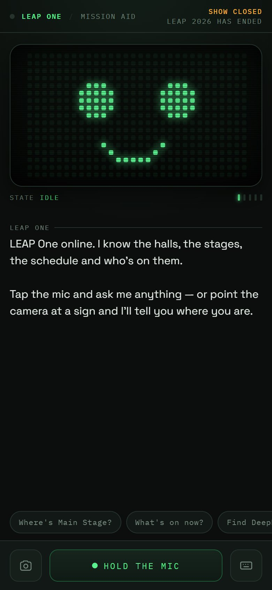

# LEAP ONE — a voice companion for LEAP 2026

A pocket AI guide built for attendees of **LEAP 2026**, the tech conference at RECC Malham, Riyadh. Hold the mic and ask where the Main Stage is, what's on right now, or how to plan the next hour. Or point the camera at a hall sign or booth banner and ask *"where do I go from here?"*. It answers **out loud**, in two to four sentences, in English or Arabic.

**Live:** https://abdullah2036.github.io/leap-one/leap-one.html



## Features

- **Voice in, voice out:** speech recognition (Web Speech API) for questions, and speech synthesis that picks the best available natural voice for replies
- **Camera questions:** snap a sign, badge, map panel or product; the photo is sent with your question to a vision-capable model
- **Grounded answers:** a hand-built knowledge base of the venue, halls, stages, programme, DeepFest, transport, parking, food and dress code is injected into the system prompt as ground truth
- **Honesty rules:** it never invents booth numbers or prayer-room/first-aid locations; it points you to the official map or an info desk instead, and uses **web search** only for live or missing details
- **Knows the time:** the show-day status and a KSA clock (UTC+3) are passed in, so "what's on now?" is answered against the right day
- **Quick-question chips**, a text field fallback, and an Arabic switch
- **An animated dot-matrix face** that changes with each state: idle, listening, thinking, speaking

## How it works

```
 mic ─▶ SpeechRecognition ─┐
 camera ─▶ getUserMedia ───┼─▶ Claude Messages API ─▶ reply ─▶ speechSynthesis
 text / chips ─────────────┘   (system prompt = rules + live clock + venue knowledge base,
                                 web_search tool, last 8 turns of history)
```

The conversation keeps the last 8 turns and strips older images to stay light.

> **Hosting note:** the page calls the Anthropic Messages API directly from the browser and was built to run inside a Claude artifact, where requests are authenticated for you. To host it anywhere else, route the request through a small server-side proxy that adds your API key; never put a key in the page.

## Tech stack

Single-file HTML / CSS / JavaScript · Web Speech API (recognition + synthesis) · MediaDevices camera · Canvas · Claude (Anthropic Messages API) with the web search tool

## Project structure

```
leap-one/
└── leap-one.html   UI, dot-matrix face renderer, KSA clock, venue knowledge base,
                    system prompt, voice + camera handling, API call
```

---

Built by **Abdullah Bokhary** · [Portfolio](https://abdullah.pageui.workers.dev/) · [LinkedIn](https://www.linkedin.com/in/abdullah-bokhary-840315326/) · [GitHub](https://github.com/abdullah2036)
